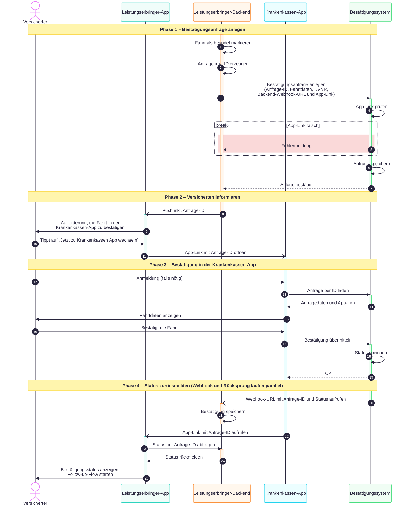

# App Interaktion Workflow

## Workflow Anmeldung

## Workflow Bestätigung

```mermaid
---
config:
  theme: redux-color
---
sequenceDiagram
    actor V as Versicherter
    participant LER_APP as Leistungserbringer-App
    participant LER_BE as Leistungserbringer-Backend
    participant KK_APP as Krankenkassen-App
    participant BS as Bestätigungssystem
    autonumber


    Note over V,BS: Phase 1 – Bestätigungsanfrage anlegen
    activate LER_BE
    LER_BE->>LER_BE: Fahrt als beendet markieren
    LER_BE->>LER_BE: Anfrage inkl. ID erzeugen
    LER_BE->>BS: Bestätigungsanfrage anlegen<br>(Anfrage-ID, Fahrtdaten, KVNR,<br>Backend-Webhook-URL und App-Link)
    activate BS
    BS->>BS: App-Link prüfen
    break App-Link falsch
     rect rgba(220, 0, 0, 0.15)
        BS-->>LER_BE: Fehlermeldung
        end
    end
    BS->>BS: Anfrage speichern
    BS-->>LER_BE: Anlage bestätigt
    deactivate BS

    Note over V,BS: Phase 2 – Versicherten informieren
    LER_BE-)LER_APP: Push inkl. Anfrage-ID
    deactivate LER_BE
    activate LER_APP
    LER_APP->>V: Aufforderung, die Fahrt in der<br>Krankenkassen-App zu bestätigen
    V->>LER_APP: Tippt auf „Jetzt zu Krankenkassen App wechseln“
    LER_APP-)KK_APP: App-Link mit Anfrage-ID öffnen
    deactivate LER_APP
    activate KK_APP

    Note over V,BS: Phase 3 – Bestätigung in der Krankenkassen-App
    V->>KK_APP: Anmeldung (falls nötig)
    KK_APP->>BS: Anfrage per ID laden
    activate BS
    BS-->>KK_APP: Anfragedaten und App-Link
    deactivate BS
    KK_APP->>V: Fahrtdaten anzeigen
    V->>KK_APP: Bestätigt die Fahrt
    KK_APP->>BS: Bestätigung übermitteln
    activate BS
    BS->>BS: Status speichern
    BS-->>KK_APP: OK

    Note over V,BS: Phase 4 – Status zurückmelden (Webhook und Rücksprung laufen parallel)
    BS-)LER_BE: Webhook-URL mit Anfrage-ID und Status aufrufen
    deactivate BS
    activate LER_BE
    LER_BE->>LER_BE: Bestätigung speichern
    deactivate LER_BE
    KK_APP-)LER_APP: App-Link mit Anfrage-ID aufrufen
    deactivate KK_APP
    activate LER_APP
    LER_APP->>LER_BE: Status per Anfrage-ID abfragen
    activate LER_BE
    LER_BE-->>LER_APP: Status rückmelden
    deactivate LER_BE
    LER_APP->>V: Bestätigungsstatus anzeigen,<br>Follow-up-Flow starten
    deactivate LER_APP
```
